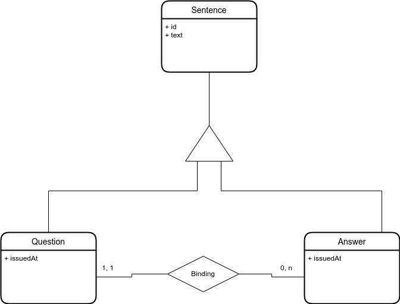
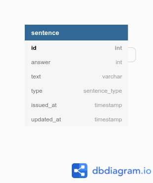

# Questions API

## SUMÁRIO

- [Questions API](#questions-api)
  - [SUMÁRIO](#sumário)
  - [INTRODUÇÃO](#introdução)
  - [DEPLOY](#deploy)
  - [SETUP_LOCAL](#setup_local)
    - [Inatalar as dependências](#inatalar-as-dependências)
    - [Criar modelo de dados](#criar-modelo-de-dados)
    - [Executar o app](#executar-o-app)
    - [Executar os testes](#executar-os-testes)
  - [DATABASE](#database)
    - [Diagrama ER](#diagrama-er)
    - [Modelo Lógico](#modelo-lógico)
  - [Endpoints](#endpoints)
    - [Disponíneis e documentados em:](#disponíneis-e-documentados-em)

## INTRODUÇÃO

    Uma REST API com Banco de Dados PostgreSQL.

## DEPLOY
    `docker-compose up -d` cria o ambiente, instala as dependências e inicia a aplicação.
## SETUP_LOCAL

### Inatalar as dependências

    yarn install
### Criar modelo de dados

    yarn migrate

### Executar o app

    yarn dev

### Executar os testes

    yarn test

## DATABASE

### Diagrama ER

### Modelo Lógico

## Endpoints

### Disponíneis e documentados em:

http://localhost:4202/api/docs/#/

Documentados com Swagger, podem ser testados prontamente na url acima com o app executando.